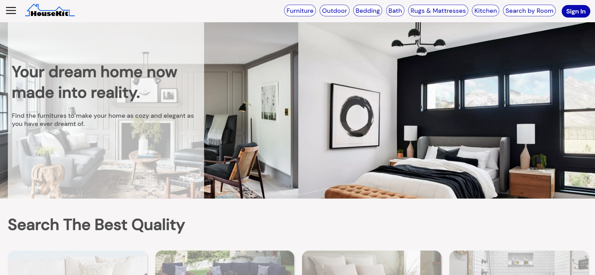
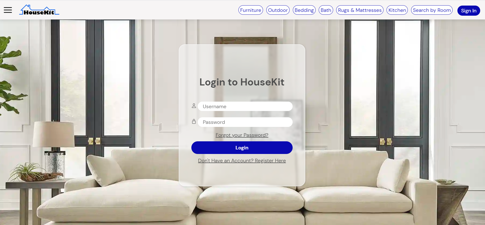

# HouseKit
HouseKit is a House Furniture Website created to test my early skills with HTML and CSS.
This website is still under development, but it contains basic HTML and CSS features such as nesting, grids, flexboxes, and a modern-styled UI.
## Preview of the Homepage:

Missing features, such as responsiveness and overall interactivity with JavaScript, may be implemented in the feature.
## Update (5/22/2023):
It now includes a Login page, as seen below:
